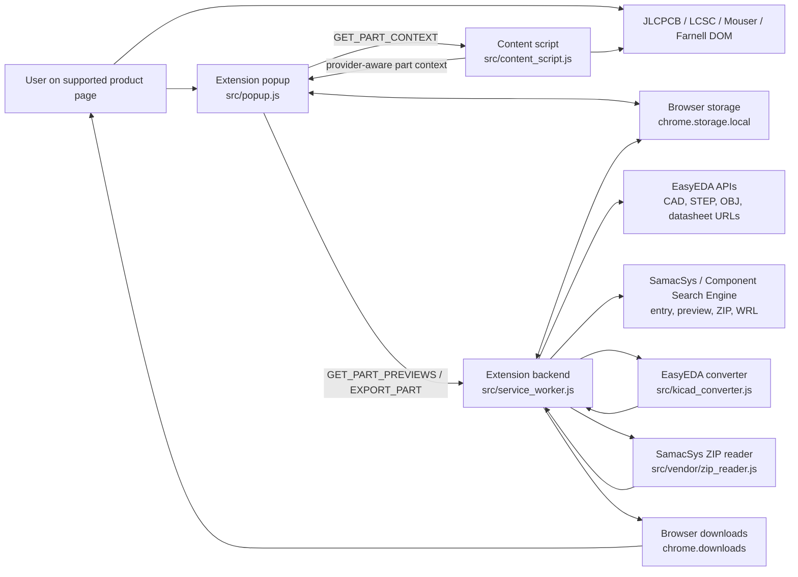

# System Design: EasyEDA Downloader

## 1. Purpose

This document describes the current implemented design of the EasyEDA Downloader browser extension.

The extension supports three provider flows:

- EasyEDA-backed JLCPCB and LCSC pages
- Mouser pages that expose the SamacSys / Component Search Engine ECAD button
- Farnell pages that expose the Supplyframe / SamacSys ECAD link

The repository remains intentionally compact. If code and design diverge, update one of them in the same change.

## 2. Implemented workflow

### 2.1 Supported operator flow

1. Open a supported JLCPCB, LCSC, Mouser, or Farnell product page.
2. Open the extension popup.
3. Ask the content script for a provider-aware part context via `GET_PART_CONTEXT`.
4. Ask the service worker for `GET_PART_PREVIEWS`.
5. Choose which artifacts to export and whether to download them individually.
6. Ask the service worker to export the current part with `EXPORT_PART`.

### 2.2 Explicit non-goals

The current repository does not implement:

- browser automation outside the popup/content-script/service-worker model
- end-to-end browser-run integration tests in real Chrome or Firefox
- a project-hosted proxy or cloud backend for Mouser / SamacSys Firefox support
- a broader application-layer architecture beyond the existing file split

## 3. Supported contexts and assumptions

- The content script is injected only on matching JLCPCB, LCSC, Mouser, and Farnell pages.
- EasyEDA-backed pages expose an LCSC-style part id such as `C12345`.
- Mouser support depends on the ECAD button `#lnk_CadModel[data-testid="ProductInfoECAD"]`.
- Farnell support depends on a Supplyframe / SamacSys link exposed in the `ECAD / MCAD` section.
- The content script returns a generic part context, not a provider-specific ad hoc message shape.
- EasyEDA previews are generated locally from CAD payload primitives.
- SamacSys distributor previews come from SamacSys JSON preview endpoints and are displayed as PNG data URLs.
- EasyEDA datasheet availability comes from URLs exposed by the upstream payload.
- SamacSys distributor datasheet export is currently unsupported.
- SamacSys distributor preview and export work directly in Chrome.
- Firefox SamacSys support is opt-in and depends on a user-managed relay URL stored in popup settings.
- SamacSys ZIP export may still require upstream authentication; when the ZIP endpoint returns `401`, the worker surfaces a sign-in-required error instead of a generic download failure.
- In Firefox relay mode, the service worker forwards matching `componentsearchengine.com` cookies through the relay so authenticated ZIP downloads can reuse the user's upstream browser session.
- Firefox relay mode can send a separate relay `Authorization` header on the Worker POST when the user configures proxy auth.
- Firefox relay mode can forward an upstream SamacSys `Authorization` header for ZIP endpoints that rely on HTTP Basic auth instead of cookies alone, preferring the manual override and otherwise reusing the latest Firefox-captured upstream header.
- The Manifest V3 background is declared for both Chrome and Firefox: Chrome uses `background.service_worker`, while Firefox uses the background-document fallback from `background.scripts`. This combined manifest relies on Firefox 121 or newer.
- The configurable library download root must remain relative to the browser's Downloads directory.

## 4. Repository architecture

### 4.1 User-to-backend flow

There is no application-owned cloud backend in this repository. The service worker is the browser-local backend boundary, and it calls external upstream provider services when previews or exports require network data.

### 4.2 `src/content_script.js`

Owns page inspection only:

- detect EasyEDA/LCSC identifiers from definition lists, known tables, and page text
- detect Mouser SamacSys ECAD availability from the ECAD button
- detect Farnell SamacSys ECAD availability from the `Supply Frame Models Link`
- read provider-specific source part metadata from the page DOM
- reconstruct the Mouser SamacSys entry URL from `loadPartDiv(...)`
- reconstruct the Farnell SamacSys entry URL from the Supplyframe link metadata
- reply to popup-originated `GET_PART_CONTEXT` requests

It remains a DOM-reading boundary with no network or download logic.

### 4.3 `src/popup.js`

Owns popup UI state and user interaction:

- cache popup DOM elements
- load and save popup settings through `chrome.storage.local`
- query the active tab and request the current provider-aware part context
- render the fixed `Mfr. Part #` row plus a dynamic provider-specific source row
- request previews and datasheet availability
- gate downloads based on provider support and checkbox selection
- expose advanced Firefox SamacSys relay settings, including separate relay auth, optional stored SamacSys credentials, read-only captured-auth status, and a manual upstream auth override
- send `EXPORT_PART` requests to the service worker

It remains the UI-facing boundary. It does not own fetch, archive extraction, or conversion logic.

### 4.4 `src/service_worker.js`

Owns runtime registration only:

- register the Manifest V3 background message listener
- delegate request handling to the runtime/router module

The operational core now lives behind this entrypoint rather than inside one file.

### 4.5 `src/service_worker_runtime.js` and supporting modules

Own the service-worker backend orchestration:

- normalize part context and route preview/export requests by provider
- enforce runtime-specific blocking such as Firefox SamacSys gating when no relay is configured
- capture the latest Firefox SamacSys upstream `Authorization` header through `webRequest` and persist it for relay reuse
- orchestrate Firefox SamacSys auth refresh and retry behavior after ZIP-auth failures and wait for a fresh captured upstream `Authorization`
- compose source adapters with shared download, storage, and settings helpers
- shape success and error responses back to the popup

The runtime is intentionally split into:

- source adapters under `src/sources/`
- shared worker business logic under `src/core/`

Within `src/sources/`, the current SamacSys-backed distributors share:

- `src/sources/samacsys_distributor_adapter.js` for provider-facing preview/export orchestration
- `src/sources/samacsys_common.js` for shared SamacSys page, preview, ZIP, and asset-rewrite helpers

This keeps the message boundary stable while allowing future sources to be added without expanding the entrypoint.

### 4.6 `src/kicad_converter.js`

Keeps the public conversion API stable and delegates implementation to focused converter modules under `src/kicad/`.

Those modules own:

- EasyEDA symbol parsing
- EasyEDA footprint parsing
- coordinate, unit, and text-style conversion
- KiCad symbol text generation
- KiCad footprint text generation
- OBJ-to-WRL conversion

Mouser parts do not flow through this converter for symbol or footprint generation because the upstream ZIP already contains KiCad assets.

### 4.7 `src/vendor/zip_reader.js`

Owns small runtime archive extraction support:

- ZIP central-directory parsing
- stored-entry reads
- deflate-entry reads through runtime decompression primitives

It exists so the service worker can extract the KiCad subtree from the SamacSys ZIP without adding a build step.

### 4.8 `tests`

The test suite remains the primary regression net for:

- page-detection logic
- popup state transitions and messaging
- service-worker orchestration and download behavior
- EasyEDA conversion behavior
- repository governance and footer discipline

## 5. Core data flow

### 5.1 Detect the current part

- The popup queries the active tab.
- The popup asks the content script for `GET_PART_CONTEXT`.
- On EasyEDA-backed pages, the content script returns:
  - provider `easyedaLcsc`
  - source label `LCSC part`
  - source part number equal to the detected LCSC id
  - manufacturer part number when the page exposes `Mfr. Part #`
  - lookup metadata containing the LCSC id
- On Mouser pages, the content script returns:
  - provider `mouserSamacsys`
  - source label `Mouser part`
  - source part number equal to `Mouser No`
  - manufacturer part number equal to `Mfr. No`
  - lookup metadata containing manufacturer name and a reconstructed SamacSys entry URL
- On Farnell pages, the content script returns:
  - provider `farnellSamacsys`
  - source label `Farnell part`
  - source part number equal to the detected Farnell order code or page part identifier
  - manufacturer part number from the SamacSys link metadata or page text
  - lookup metadata containing manufacturer name and a reconstructed SamacSys entry URL

### 5.2 Request previews

- The popup asks the service worker for `GET_PART_PREVIEWS`.
- EasyEDA-backed pages:
  - fetch the EasyEDA CAD payload
  - synthesize symbol and footprint SVG previews
  - derive datasheet availability from the payload
- Mouser and Farnell pages:
  - fetch the SamacSys entry URL
  - follow the part-page redirect and parse the ZIP form and preview token
  - fetch `symbol.php` and `footprint.php` JSON previews
  - return PNG data URLs
  - report datasheet unavailable
- In Firefox, those same SamacSys requests are sent through the optional user-managed relay when configured; otherwise they fail early with the existing proxy-required error.
- In Firefox relay mode, the worker attaches the current SamacSys cookie header to proxied requests when browser cookies are available.
- In Firefox relay mode, the worker sends any configured relay `Authorization` header only on the Worker POST itself.
- In Firefox relay mode, the worker forwards upstream SamacSys `Authorization` using this precedence:
  - manual override from popup settings
  - locally generated HTTP Basic auth header from stored SamacSys username and password
  - latest Firefox-captured upstream header
  - no upstream authorization header
### 5.3 Export EasyEDA-backed parts

- The service worker fetches the EasyEDA payload using the detected LCSC id.
- The converter produces KiCad symbol and footprint text.
- Symbol, footprint, 3D, and datasheet exports follow the existing current-provider settings:
  - loose-file downloads when `downloadIndividually` is `true`
  - KiCad-style library structure when `downloadIndividually` is `false`
- Library-mode symbol exports merge into a stored symbol library keyed by the resolved library root.

### 5.4 Export SamacSys distributor parts

- The service worker fetches the SamacSys entry URL and resolves the part page.
- In Firefox with a configured relay, the service worker sends those SamacSys HTTP requests through the relay instead of fetching upstream directly.
- In Firefox with a configured relay, the service worker also reads the matching upstream cookies through `chrome.cookies` and forwards them with those proxied requests.
- For authenticated ZIP flows that use HTTP Basic auth, the service worker forwards upstream SamacSys `Authorization` from the manual override when present, otherwise from locally generated Basic auth when stored credentials exist, and otherwise from the latest Firefox-captured header.
- When proxy auth is configured, the relay POST itself also carries a separate relay `Authorization` header that is never forwarded upstream.
- When Firefox SamacSys ZIP export returns the sign-in-required `401` error, the runtime tells the current product tab to trigger its native SamacSys ECAD flow once, waits for the first new captured upstream `Authorization` header, and retries that export one time.
- The part page supplies:
  - a stable `partID`
  - a preview token
  - ZIP download form metadata
- The service worker downloads the SamacSys ZIP and extracts only:
  - `KiCad/*.kicad_sym`
  - `KiCad/*.kicad_mod`
  - `3D/*.stp`
  - optional `3D/*.wrl`
- Loose-file mode downloads the extracted files directly into Downloads.
- Library mode repackages the extracted assets into the current KiCad structure:
  - symbol library merge into `<libraryRoot>/<libraryName>.kicad_sym`
  - footprints into `<libraryRoot>/<libraryName>.pretty/`
  - 3D assets into `<libraryRoot>/<libraryName>.3dshapes/`
- Library mode rewrites:
  - the symbol `Footprint` property to `<libraryName>:<footprintName>`
  - the footprint `(model ...)` path to `../<libraryName>.3dshapes/<modelFilename>`
- When 3D export is selected, the worker exports STEP models and any WRL files already present in the SamacSys ZIP without probing extra remote WRL endpoints.

## 6. Storage and settings behavior

- `chrome.storage.local` stores popup settings:
  - `downloadIndividually`
  - `libraryDownloadRoot`
  - `samacsysFirefoxProxyBaseUrl`
  - `samacsysFirefoxProxyAuthorizationHeader`
  - `samacsysFirefoxUsername`
  - `samacsysFirefoxPassword`
  - `samacsysFirefoxAuthorizationHeader`
  - `samacsysFirefoxCapturedAuthorizationHeader`
  - `samacsysFirefoxCapturedAuthorizationCapturedAt`
- `chrome.storage.local` also stores accumulated symbol library text used for append-style symbol exports in library mode.
- Stored symbol-library content is keyed by the resolved library root so separate library folders keep separate merged symbol libraries.

## 7. Error and warning handling

- Detection failures in the popup produce user-facing status messages and disable export.
- Service-worker preview failures return structured error responses to the popup.
- Export failures return structured error responses to the popup.
- Partial export issues that do not invalidate the whole request, such as missing datasheets, are accumulated as warnings.
- SamacSys distributor requests in Firefox fail early with a structured unsupported error message when no relay is configured.
- Relay transport failures are surfaced distinctly from upstream SamacSys HTTP failures.
- SamacSys ZIP `401 Unauthorized` responses are rewritten into a sign-in-required error so the popup can tell the user what upstream precondition is missing.
- Firefox SamacSys automatic auth refresh failures, such as timeout or missing auth capture before retry, are returned as structured popup/runtime errors without mutating the previously stored captured auth state.

## 8. External dependencies and browser APIs

### 8.1 Network dependencies

- EasyEDA component API for CAD payloads
- EasyEDA module endpoints for STEP and OBJ assets
- SamacSys / Component Search Engine entry page, preview JSON endpoints, and ZIP download endpoint

### 8.2 Browser APIs

- `chrome.runtime`
- `chrome.storage.local`
- `chrome.downloads`
- `chrome.cookies` for Firefox relay cookie forwarding on SamacSys requests
- `chrome.webRequest` for Firefox SamacSys upstream `Authorization` capture
- `chrome.tabs.sendMessage` for Firefox SamacSys automatic same-tab auth refresh orchestration
- `Blob` and `URL.createObjectURL`
- runtime decompression primitives used by the vendored ZIP reader

## 9. Output artifacts and naming rules

- EasyEDA symbol output uses a standalone `<lcscId>-<symbolName>.kicad_sym` file in loose mode or the shared library file in library mode.
- SamacSys distributor loose-file symbol output keeps the extracted `.kicad_sym` filename from the ZIP.
- Footprint output uses the extracted or generated `.kicad_mod` filename.
- SamacSys distributor footprint library-mode downloads rewrite the model path into the library `.3dshapes` directory.
- EasyEDA datasheet output uses a sanitized base name plus `-datasheet` and the detected extension.
- The library root name defaults to `easyEDADownloader` and can be changed to another Downloads-relative folder for library mode.

## 10. Maintainability and testing boundaries

- `src/kicad_converter.js` should stay the main unit-test target for pure conversion rules.
- `src/content_script.js` should stay small enough to test through DOM fixtures and message mocks.
- `src/popup.js` should be tested with DOM fixtures and mocked browser APIs rather than real extension runs.
- `src/service_worker_runtime.js` should be tested with mocked browser APIs, mocked fetch, mocked archive extraction, and controlled converter stubs.
- The current Vitest/Vite/jsdom test stack requires Node `20.19.0+`, `22.13.0+`, or `24+`.
- Production source should not be refactored solely to make tests easier; harnesses should adapt to the existing code shape.

## 11. Repository rules that should remain true

- Do not change extension runtime behavior casually.
- Do not reorganize production files without a real architectural reason.
- Keep browser API orchestration in the service worker, UI state in the popup, DOM extraction in the content script, and conversion rules in the converter.
- Keep governance files and hygiene tests aligned with the codebase.
